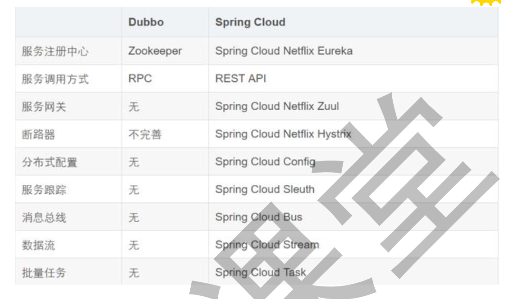

# 第1节 服务的前世今生

## Dubbo和Spring Cloud的关系

Dubbo是SOA时代的产物，它的关注点主要在于服务的调用、流量分发、流量监控和熔断。而Spring Cloud诞生于微服务架构时代，考虑的是微服务治理的方方面面，另外由于依托了Spring、Spring Boot的优势之上，两个框架在开始目标就不一致，Dubbo定位服务治理、Spring Cloud是一个生态。

**最大的区别**

Dubbo底层是使用Netty这样的NIO框架，是基于TCP协议传输的，配合以Hession序列化完成RPC通信；

Spring Cloud是基于HTTP协议+Rest接口调用远程过程的通信，相对来说，HTTP请求会有更大的报文，占的宽带也会更多。但是REST相比RPC更加灵活，服务提供方和调用方的依赖靠一纸契约，不存在代码级别的强依赖。