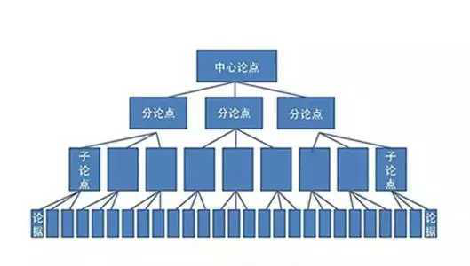

# 1 《金字塔原理》书评

“金字塔原理”是个好东西，但《金字塔原理》这本书不值得花太多时间去读。

 

这样说的原因有三：

1、这本书很枯燥，读起来真的没什么意思。（我看的是中文版，不知道原版啥样，反正看豆瓣评论，很多人读几页以后就读不下去了）

2、本来几百字就能讲清楚的一个道理，作者明托硬是写了两本书，并且写的“又臭又长”，读起来浪费时间。

如果你想用五分钟了解“金字塔原理”，我倒是推荐你读读冯唐的《老聃的金字塔原理》，作为前麦肯锡员工，冯唐对于金字塔原理的理解还是很到位的，并且冯唐这篇文章很短，通篇都在说人话。（冯唐原文见文末阅读原文）

3、不过，“金字塔原理”确实是一个思考、表达的好工具，虽然冯唐一直在埋汰明托老太太“凑字数骗钱”，但是他自己也承认：金字塔原理，是他在麦肯锡收获的最宝贵最有用的玩意儿。

所以，如果是没时间读书或者不喜欢读书，但是又想了解一下《金字塔原理》是何方神圣，你可以继续往下看，我争取用一千字把它讲清楚。

 

**金字塔原理是啥？**

它是思考和表达的一种模式，任何事情都可以提取出一个中心论点，然后下面有三到七个分论点做支撑，每个分论点下面再有三到七个分分论点做支撑，这样一层一层延伸，就像金字塔。

 

 

 

是不是有点眼熟？这不就是小时候写作文时的“总分总结构”吗，“论点论据论证”，你这样理解也不能算错，明托老太厉害（或者说精明）的地方就是她把它包装成了一个概念，并且写了两大本书。

 

**使用金字塔原理需要注意啥？**

 

不要简单地把金字塔原理理解成“一生三，三生九”这样的一个层级结构，那就太小看明托老太了，她还提出了搭建这个层级结构的一个重要原则：**MECE法则**。

 

具体意思就是，各个分论点之间要“相互独立、完全穷尽”，说白了就是要不重不漏。

 

MECE法则是提高思考质量和效率的重要法则，这一点真的非常有价值。

 

论点不重复，你就不用做无用功，提高思考效率；论点没遗漏，你的思维就严谨，滴水不漏，这样的思考才最有质量。

 

上面主要说的是论点的横向关系，不重不漏。金字塔原理对论点的纵向关系上也有要求。具体来说，上一层论点是下一层论点的总结和结论，下一层观点是上一层观点的论据支撑，从上到下逐层展开，从下到上逐层支撑。

 

当我们表达的时候，需要从上到下，结论先行，一层一层展开，具体展开到多少层，看你有多长时间可以说；思考的时候，从下到上，先多方面搜集资料，然后整理归纳，向上得出结论。

 

所以，MECE法则是思考和表达的一个好工具，不过，想要熟练运用，还是需要多练习。介绍我的一个方法，每天找一个话题，按住微信的录音键，说两分钟，按照MECE法则，刚好说完三个点。“一个话题，两分钟，说三个点”，按照这个套路多练习，你的表达能力会有大的提升。

 

另外，金字塔原理中还提到了一个表达的“SCQA”结构，就是“情景-冲突-问题-答案”模型，之前我有写文章专门讲过，这里就不细说了。（[戳这里看原文](https://link.zhihu.com/?target=http://mp.weixin.qq.com/s?__biz=MzAxNTg4MzYyMg==&mid=2247485133&idx=1&sn=efd5e9f8fcc777420cd0da2a968bd103&chksm=9bfc0ac4ac8b83d2ce94b74cb3a79510292ff86bd2fcf0fca984eb2653e6c6efebf71f614afd&scene=21%23wechat_redirect)）

 

最后，再多说两句《金字塔原理》这本书，虽然明托大说特说金字塔原理，但是她的这本书却并不太符合她口口声声说的那些原则：

 

1、她说要学会讲故事，提高观众的注意力。但是她这本书几乎没啥故事可言。

2、金字塔原理的目的是为了让思考清晰表达清晰，但是《金字塔原理》整本书给人的感觉是结构混乱，看书的目录，她自己都没有认真遵守MECE法则。

3、金字塔原理倡导观点简洁明快、逻辑清晰，但是老太太一直在那里啰啰嗦嗦，这可能是培训师的职业病吧。

 

**最后的最后，再说一句：金字塔原理主要适用于公文和商务类写作，不要写啥都用，以免走火入魔。**